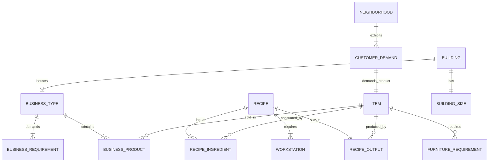

# Big Ambitions Domain Data Model

## Core Entities & Relationships

### 1. Item (`BigAmbitions.Items.Item`)
- **Identification:** `itemName` (string ID / localized key), `type` (`ItemType` flags: RetailProduct, ServiceProduct, RawMaterial, Food, Drink, etc.).
- **Economics:** `wholesalePrice` (float), `defaultMarketPrice` (float), `productSalesRatio` (float, hourly customers per $m^2$).
- **Logistics:** `boxSize` (int), `canPutInShoppingBasket` (bool), `cargoCapacity` (int), `cargoCapacityMultiplier` (float).
- **Furniture Properties:** `isFurniture` (bool), `gridSize` (float), `quality` (int), `addedCustomersPerHour` (int), `wallMounted` (bool).
- **Factory Properties:** `isProducer` (bool), `producerSettings` (`itemsToProduce`).

### 2. BusinessType (`BusinessType`)
- **Identification:** `businessTypeName` (e.g. `ba:businesstype_supermarket`), `suitableBuildingType`.
- **Products:** List of `BusinessProduct` (`itemName`, `impact` factor).
- **Requirements:** List of `BusinessRequirement` (furniture, registers, shelves, storage, toilets, seating).
- **Operations:** `spawnCustomers` (bool), `hasEntranceFee` (bool), `maxAmountPerProduct` (float), `employeePrimarySkills` (string[]), `courseRequired` (`DiplomaName`).
- **Seasonality & Factors:** `dayFactorMultipliers`, `hourlyFactorMultipliers`.

### 3. Factory Recipe (`BigAmbitions.Factories.Recipes.Recipe`)
- **Identification:** `id` (GUID), `machineVisuals` (supported machines).
- **Ingredients:** List of `RecipeItem` (`itemName`, `amount`).
- **Output:** `RecipeItem` (`itemName`, `amount`).
- **Labor Scaling:** Worker skill (0-100%) scales output by $0.50 \times \text{skill} + 50\%$.

### 4. Building & Real Estate (`Buildings.Building`, `BuildingSizeData`)
- **Properties:** `address`, `buildingSize` (SquareMeters), `rentPerHour`, `salePrice`, `buildingType` (Retail, Office, Warehouse, Residence).

### 5. Customer Demand & Neighborhoods
- **Demands:** District base traffic, customer demographics, peak hours, luxury vs. discount preference.
